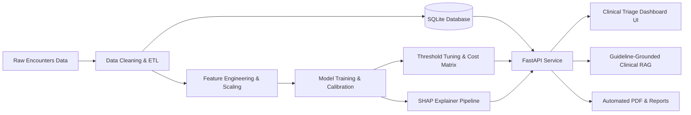

# MediTrack — Clinical Decision Support & 30-Day Readmission Risk System

[](https://www.python.org/)
[](https://fastapi.tiangolo.com/)
[](https://scikit-learn.org/)
[](https://shap.readthedocs.io/)
[](LICENSE)

MediTrack is an enterprise-grade clinical decision support system designed to predict 30-day all-cause hospital readmission risk among diabetic and inpatient populations. It pairs calibrated machine learning classifiers with local factor-level SHAP attributions, clinical safety guardrails, guideline-grounded discharge assistants, fairness audits, survival analysis, and financial cost modeling.

---

## 📑 Table of Contents
- [Key Features](#-key-features)
- [Architecture & Workflow](#-architecture--workflow)
- [Project Structure](#-project-structure)
- [Machine Learning Pipeline](#-machine-learning-pipeline)
- [Clinical Decision Support & Guardrails](#-clinical-decision-support--guardrails)
- [API Endpoints](#-api-endpoints)
- [Installation & Quickstart](#-installation--quickstart)
- [Running Tests](#-running-tests)
- [Notebooks & Reports](#-notebooks--reports)
- [License](#-license)

---

## 🚀 Key Features

- **Accurate & Calibrated Risk Scoring**: Optimized ensemble classifiers (Random Forest / Gradient Boosted Trees) tuned with isotonic probability calibration and cost-sensitive threshold selection.
- **Explainable AI (SHAP)**: Patient-level Waterfall/attribution breakdown explaining top positive and negative risk contributors for every encounter.
- **Guideline-Grounded Assistant (RAG)**: ADA 2024 Standards of Care and ACC/AHA discharge recommendations with safety guardrails (contraindication flags, medication reconciliation).
- **Cohort Triage Worklist**: Interactive clinical dashboard with filtering by risk tiers (Low, Medium, High, Critical), status management, and real-time encounter inspection.
- **Fairness & Subgroup Audits**: Disparate impact ratio, demographic parity, and equal opportunity evaluation across age, gender, and demographic slices.
- **Survival Analysis (Kaplan-Meier)**: Time-to-event estimation and readmission hazard modeling across patient cohorts.
- **Financial Cost Optimization**: Net savings simulation assessing intervention costs versus CMS Hospital Readmissions Reduction Program (HRRP) penalty reductions.
- **Drift & Quality Monitoring**: Population stability index (PSI) and feature drift tracking between training baselines and prospective encounters.
- **Automated PDF & Presentation Generation**: Automated clinical summary report generator and executive slide decks.

---

## 🏗 Architecture & Workflow



---

## 📂 Project Structure

```
meditrack/
├── app/
│   ├── main.py                     # FastAPI application & REST endpoints
│   └── static/
│       ├── index.html              # Clinical triage dashboard single-page interface
│       ├── app.js                  # Frontend interactions, charts & API clients
│       └── styles.css              # Custom responsive healthcare UI styling
├── data/
│   ├── raw/                        # Original UCI Diabetes 130-US hospitals dataset
│   ├── processed/                  # Cleaned and standardized encounter records
│   └── meditrack.db                # Indexed SQLite relational database
├── models/
│   ├── best_model.joblib           # Trained calibrated classifier
│   ├── preprocessor.joblib         # ColumnTransformer with scalers & encoders
│   ├── shap_explainer.joblib       # TreeExplainer artifact
│   ├── feature_names.json          # Aligned feature schema
│   └── threshold_config.json       # Operating thresholds for clinical recall
├── notebooks/
│   ├── 01_data_preparation_and_statistical_analysis.ipynb
│   ├── 02_database_and_sql_queries.ipynb
│   ├── 03_predictive_modelling_threshold_tuning.ipynb
│   └── 04_text_processing_and_neural_baseline.ipynb
├── reports/
│   ├── fairness_audit_results.json
│   ├── drift_monitoring_results.json
│   ├── survival_analysis_results.json
│   ├── financial_cost_model_results.json
│   └── meditrack_clinical_dashboard.pdf
├── slides/
│   └── meditrack_presentation_slides.pdf
├── sql/
│   ├── schema.sql                  # DDL tables, indexes, and views
│   └── queries.sql                 # Clinical analytics & cohort queries
├── src/
│   ├── data_prep.py                # Ingestion, imputation & feature extraction
│   ├── analysis.py                 # Statistical hypothesis testing & EDA
│   ├── db_setup.py                 # Relational schema setup & database build
│   ├── model_pipeline.py           # Training, cross-validation & evaluation
│   ├── clinical_rag.py             # Guardrailed guideline retrieval & advice
│   ├── extensions.py               # Survival analysis, drift, fairness & cost model
│   ├── export_dashboard_pdf.py     # PDF summary generation with ReportLab
│   └── export_presentation_slides.py
├── tests/
│   └── test_meditrack.py           # Comprehensive pytest suite
├── requirements.txt
├── .gitignore
└── README.md
```

---

## 🔬 Machine Learning Pipeline

### Data & Preprocessing
Derived from the 10-year (1999–2008) clinical database of 130 US hospitals (100,000+ encounters).
- **Target Variable**: 30-day all-cause hospital readmission (`<30` days vs `>=30` / `NO`).
- **Features**: Demographics (age brackets, gender, race), clinical utilization (inpatient, emergency, and outpatient visits in preceding 12 months), diagnoses (ICD-9 categorization for diabetes, circulatory, respiratory, metabolic), lab indicators (number of lab procedures, glucose tests, HbA1c result), and pharmacological regimens (23 diabetes medications tracked for dosages and alterations).
- **Class Imbalance & Calibration**: Evaluated using Stratified K-Fold cross validation, Brier score verification, and probability calibration via isotonic regression.
- **Operating Threshold Tuning**: Selected at minimum total expected cost using hospital financial penalties:
  $$\text{Threshold}^* = \arg\min_t \left( C_{FP} \cdot \text{FP}(t) + C_{FN} \cdot \text{FN}(t) \right)$$

---

## 🛡 Clinical Decision Support & Guardrails

The clinical recommendation engine adheres to evidence-based protocols:
1. **American Diabetes Association (ADA 2024)**: Post-discharge glycemic targets, CGM recommendation, and follow-up intervals within 7–14 days for high-risk patients.
2. **Heart Failure & Renal Protection**: SGLT2 inhibitor / GLP-1 RA prioritization for patients with co-occurring cardiovascular or chronic kidney disease.
3. **Safety Guardrails**:
   - Hypoglycemia warning triggers on active insulin or sulfonylurea dosage changes.
   - Polypharmacy interaction check when concurrent medications exceed 15.
   - Renal impairment dosage contraindications flagged when eGFR/creatinine lab indicators warrant caution.

---

## 🌐 API Endpoints

| Method | Endpoint | Description |
| :--- | :--- | :--- |
| `GET` | `/` | Web application interface |
| `GET` | `/api/encounters` | Search & paginate encounters with risk scores & filters |
| `GET` | `/api/encounter/{id}` | Detailed clinical record and lab profile |
| `POST` | `/api/predict` | Real-time 30-day readmission risk score & tier calculation |
| `GET` | `/api/explain/{id}` | Patient-level SHAP attributions and feature contributions |
| `POST` | `/api/assistant/chat` | Guardrailed clinical guideline discharge recommendation |
| `POST` | `/api/triage/status` | Update care-team triage status (`Pending`, `Reviewed`, `Intervened`) |
| `GET` | `/api/dashboard/summary` | Population metrics, quality KPIs, and risk distribution |
| `GET` | `/api/export/pdf` | Download clinical quality dashboard report (PDF) |

---

## ⚡ Installation & Quickstart

### Prerequisites
- Python 3.10, 3.11, or 3.12
- SQLite 3

### 1. Clone the repository
```bash
git clone https://github.com/02falgun/MediTrack.git
cd MediTrack
```

### 2. Create and activate a virtual environment
```bash
python3 -m venv .venv
source .venv/bin/activate    # On Windows: .venv\Scripts\activate
```

### 3. Install dependencies
```bash
pip install -r requirements.txt
```

### 4. Launch the application
```bash
uvicorn app.main:app --host 0.0.0.0 --port 8000 --reload
```
Open your browser and navigate to:
```
http://localhost:8000
```
Interactive OpenAPI documentation is available at:
```
http://localhost:8000/docs
```

---

## 🧪 Running Tests

Execute the automated test suite covering endpoints, ML pipelines, database queries, and clinical guardrails:

```bash
PYTHONPATH=. pytest -v
```

---

## 📊 Notebooks & Reports

Four research and technical notebooks are included under `notebooks/`:
- **`01_data_preparation_and_statistical_analysis.ipynb`**: Data extraction, missing value analysis, chi-squared tests, and ANOVA.
- **`02_database_and_sql_queries.ipynb`**: Relational database normalization, indexing strategy, and cohort SQL queries.
- **`03_predictive_modelling_threshold_tuning.ipynb`**: Model comparison, ROC/PR curves, SHAP explainability, and threshold optimization.
- **`04_text_processing_and_neural_baseline.ipynb`**: Discharge summary text baseline, vector embeddings, and neural modeling comparison.

---

## 📄 License

This project is licensed under the MIT License - see the [LICENSE](LICENSE) file for details.
